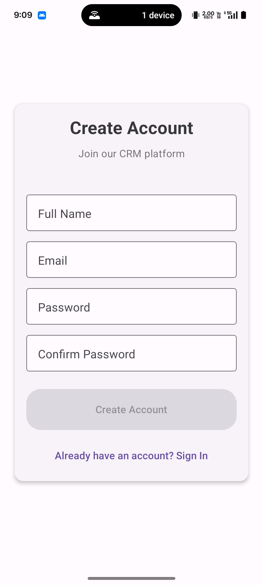
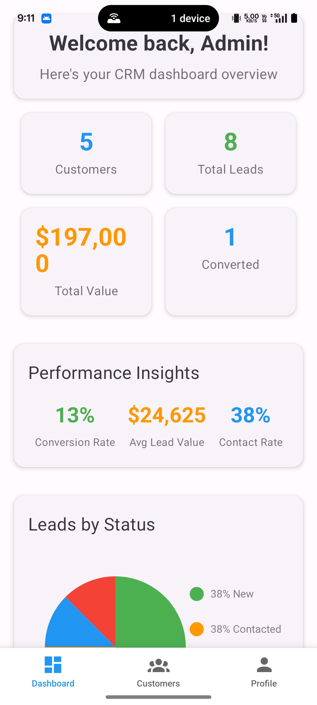
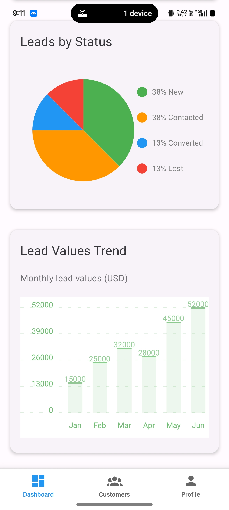
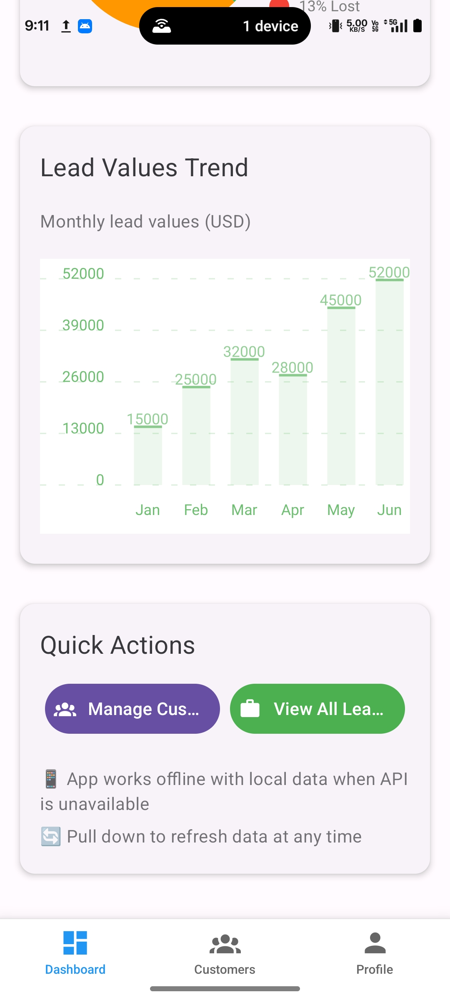
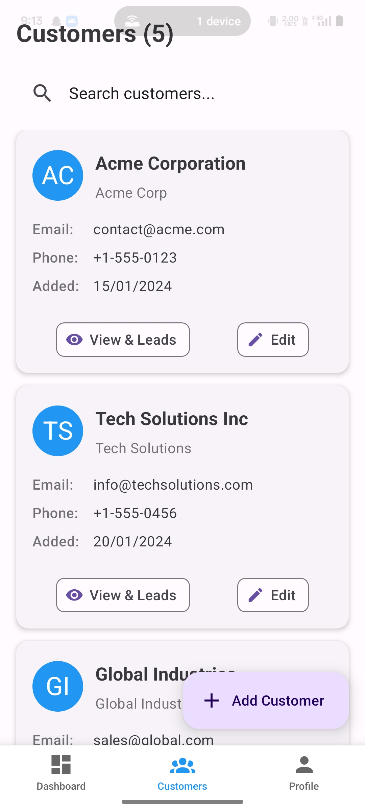
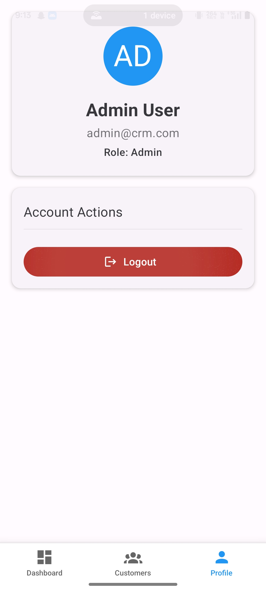

# 📱 Mini CRM - React Native Mobile Application

A comprehensive Customer Relationship Management (CRM) mobile application built with React Native, Expo, and modern development practices. This production-ready app provides complete customer and lead management functionality with beautiful data visualizations, offline support, and professional UI/UX.

<div align="center">


</div>

## 🌟 Features

### 🔐 Authentication & Security System ✅
- **JWT-based Authentication** with secure token management
- **Role-based Access Control (RBAC)** with three user roles:
  - **Admin**: Full system access (all customers, leads, users, teams)
  - **Manager**: Team-based access (team customers and leads)
  - **Sales Rep**: Individual access (own customers and leads)
- **Secure Password Hashing** using bcrypt with configurable rounds
- **Token Refresh System** with automatic session renewal
- **Account Security Features**: Failed login attempts tracking and lockout
- **Audit Trail System** with detailed activity logging

### 👥 Customer Management ✅
- **Complete CRUD Operations** (Create, Read, Update, Delete)
- **Advanced Search & Filtering** by name, email, or company
- **Detailed Customer Profiles** with comprehensive information display
- **Professional Customer Cards** with auto-generated avatars
- **Real-time Updates** with pull-to-refresh functionality
- **Seamless Navigation** between customer list and detailed views

### 🎯 Lead Management ✅
- **Full Lead Lifecycle Management** (New → Contacted → Converted/Lost)
- **Complete Lead CRUD Operations** with detailed form validation
- **Status-based Filtering** with visual color-coded indicators
- **Lead-Customer Associations** with easy cross-navigation
- **Value Tracking & Analysis** with currency formatting
- **Advanced Search Functionality** across leads, customers, and companies
- **Individual Customer Lead Management** from customer detail screens

### 📊 Data Visualization & Analytics ✅
- **Interactive Pie Charts** for lead status distribution analysis
- **Dynamic Bar Charts** for lead value trends over time
- **Performance KPI Dashboard** featuring:
  - **Conversion Rate Analysis** (Converted leads percentage)
  - **Average Lead Value Calculation** (total value / total leads)
  - **Contact Rate Metrics** (contacted leads percentage)
- **Customer-specific Analytics** with individual lead status charts
- **Real-time Chart Updates** reflecting current data changes
- **Mobile-optimized Charts** with responsive design

### 📱 User Experience & Design ✅
- **Material Design 3** implementation using React Native Paper
- **Professional Mobile Interface** optimized for touch interactions
- **Consistent Visual Language** across all screens and components
- **Intuitive Navigation** with bottom tabs and stack navigation
- **Responsive Design** adapting to various screen sizes and orientations
- **Loading States & Animations** for smooth user experience
- **Error Handling** with user-friendly messages and recovery options
- **Offline Functionality** with graceful data fallback and indicators

### 🔧 Technical Architecture ✅
- **Redux Toolkit** for efficient global state management
- **Expo Router** with file-based routing system
- **TypeScript** for comprehensive type safety and developer experience
- **Modular Component Architecture** with reusable UI components
- **Custom Hooks** for business logic abstraction
- **API Service Layer** with centralized HTTP client management
- **Form Validation** using Formik and Yup schemas
- **Persistent Storage** with AsyncStorage for offline data
- **Mock Backend Integration** using JSON Server with custom middleware

## 🚀 Tech Stack

### **Frontend Framework**
- **React Native** 0.81.4 - Cross-platform mobile development
- **Expo** ~54.0.10 - Development platform and build service
- **TypeScript** ~5.9.2 - Static type checking and enhanced IDE support
- **Expo Router** ~6.0.8 - File-based navigation system

### **State Management & Data**
- **Redux Toolkit** ^2.9.0 - Modern Redux with simplified syntax
- **React Redux** ^9.2.0 - React bindings for Redux
- **Redux Persist** ^6.0.0 - Automatic state persistence
- **AsyncStorage** ^2.2.0 - Secure local storage for React Native

### **UI/UX & Visualization**
- **React Native Paper** ^5.14.5 - Material Design 3 components
- **React Native Chart Kit** ^6.12.0 - Beautiful data visualization charts
- **React Native Vector Icons** ^10.3.0 - Comprehensive icon library
- **React Native SVG** ^15.13.0 - SVG rendering support
- **React Native Gesture Handler** ~2.28.0 - Native gesture recognition

### **Navigation & Routing**
- **React Navigation** ^7.1.17 - Flexible navigation library
- **React Navigation Bottom Tabs** ^7.4.7 - Tab-based navigation
- **React Navigation Stack** ^7.4.8 - Stack-based navigation
- **React Navigation Elements** ^2.6.3 - Navigation UI components

### **Forms & Validation**
- **Formik** ^2.4.6 - Build forms without tears
- **Yup** ^1.7.1 - JavaScript schema builder for value parsing and validation
- **@react-native-picker/picker** ^2.11.2 - Native picker components

### **HTTP Client & Backend**
- **Axios** ^1.12.2 - Promise-based HTTP client
- **JSON Server** ^1.0.0-beta.3 - Full fake REST API for rapid prototyping
- **JSONWebToken** ^9.0.2 - JWT implementation for authentication

### **Development & Testing**
- **Jest** ^30.1.3 - JavaScript testing framework
- **React Testing Library** ^13.3.3 - Testing utilities for React components
- **ESLint** ^9.25.0 - Code linting and formatting
- **Concurrently** ^9.2.1 - Run multiple commands simultaneously

## 🚀 Quick Start

### Prerequisites

- **Node.js** (v16 or higher)
- **npm** or **yarn**
- **Expo CLI** (`npm install -g @expo/cli`)
- **iOS Simulator** or **Android Emulator** (optional)
- **Expo Go** app on your mobile device (for testing)

### Installation

1. **Clone the repository**
   ```bash
   git clone https://github.com/your-username/mini-crm.git
   cd mini-crm
   ```

2. **Install dependencies**
   ```bash
   npm install
   # or
   yarn install
   ```

3. **Set up the Secure Backend**
   ```bash
   cd server
   npm install
   npm run seed    # Initialize database with demo data
   npm start       # Start the secure backend on http://localhost:3001
   ```

4. **Start the Expo development server**
   ```bash
   npm start
   # or
   expo start
   ```

5. **Run on your preferred platform**
   - **Mobile Device**: Scan QR code with Expo Go app
   - **iOS Simulator**: Press `i` in terminal
   - **Android Emulator**: Press `a` in terminal
   - **Web Browser**: Press `w` in terminal

### 🔧 Alternative Setup (Development & API Together)

Run both the API server and Expo development server simultaneously:

```bash
npm run dev
```

## 📱 Demo Credentials

Use these credentials to test the role-based authentication system:

| Role | Email | Password | Access Level |
|------|-------|----------|-------------|
| **Admin** | `admin@crm.com` | `admin123` | Full system access |
| **Manager** | `sarah@crm.com` | `manager123` | Team-based access |
| **Sales Rep** | `john@crm.com` | `user123` | Personal records only |
| **Sales Rep** | `mike@crm.com` | `sales123` | Personal records only |
| **Sales Rep** | `emma@crm.com` | `marketing123` | Personal records only |

## 🔧 Available Scripts

- `npm start` - Start Expo development server
- `npm run android` - Run on Android emulator  
- `npm run ios` - Run on iOS simulator
- `npm run web` - Run on web browser
- `npm run api-server` - Start mock API server on port 3001
- `npm run dev` - Start both API and Expo servers simultaneously
- `npm test` - Run Jest test suite
- `npm run lint` - Run ESLint code analysis

## 🏠 Project Structure

```
MiniCRM/
├── app/                          # Expo Router pages
│   ├── (tabs)/                   # Tab-based navigation
│   │   ├── index.tsx            # Dashboard screen with charts
│   │   ├── customers.tsx        # Customer list & management
│   │   └── profile.tsx          # User profile & logout
│   ├── customer-details.tsx     # Customer details & leads
│   ├── leads.tsx                # All leads management
│   ├── login.tsx                # Login screen
│   ├── register.tsx             # Registration screen
│   └── _layout.tsx              # Root layout with providers
├── src/                          # Frontend source code
│   ├── hooks/                   # Custom React hooks
│   │   └── redux.ts            # Redux typed hooks
│   ├── services/                # API services
│   │   └── api.ts              # Secure API client with JWT
│   ├── store/                   # Redux store configuration
│   │   ├── index.ts            # Store setup with persistence
│   │   └── slices/             # Redux Toolkit slices
│   │       ├── authSlice.ts    # Authentication state
│   │       ├── customerSlice.ts # Customer management
│   │       └── leadSlice.ts    # Lead management
│   └── types/                   # TypeScript definitions
│       └── index.ts            # All type definitions
├── server/                       # Secure Backend (Express.js)
│   ├── src/
│   │   ├── controllers/         # Route controllers
│   │   │   ├── authController.js    # Authentication logic
│   │   │   ├── customerController.js # Customer CRUD with RBAC
│   │   │   └── leadController.js    # Lead CRUD with RBAC
│   │   ├── middleware/          # Express middleware
│   │   │   ├── auth.js         # JWT authentication
│   │   │   ├── rbac.js         # Role-based access control
│   │   │   └── security.js     # Security headers & rate limiting
│   │   ├── models/             # Database models
│   │   │   └── database.js     # SQLite database connection
│   │   ├── routes/             # API routes
│   │   │   ├── auth.js         # Authentication routes
│   │   │   ├── customers.js    # Customer routes
│   │   │   └── leads.js        # Lead routes
│   │   ├── utils/              # Utility functions
│   │   │   ├── logger.js       # Audit logging
│   │   │   └── seed.js         # Database seeding
│   │   ├── config.js           # Server configuration
│   │   └── server.js           # Main server file
│   ├── package.json            # Backend dependencies
│   └── .env.template           # Environment variables template
├── mock-api/                    # Legacy mock backend (deprecated)
├── components/                  # Expo default components
├── constants/                   # App constants & themes
└── package.json                 # Frontend dependencies & scripts
```

## 📊 API Endpoints

The secure backend server provides the following RESTful endpoints with JWT authentication and RBAC:

### Authentication (Public)
- `POST /api/auth/login` - User login with JWT token generation
- `POST /api/auth/register` - User registration with validation
- `POST /api/auth/refresh-token` - Refresh access token
- `POST /api/auth/logout` - Logout and invalidate refresh token
- `GET /api/auth/profile` - Get current user profile

### Customers (Protected with RBAC)
- `GET /api/customers` - Get customers (filtered by user role)
- `GET /api/customers/:id` - Get specific customer by ID
- `POST /api/customers` - Create new customer
- `PUT /api/customers/:id` - Update existing customer
- `DELETE /api/customers/:id` - Delete customer (admin only)

### Leads (Protected with RBAC)
- `GET /api/leads` - Get leads (filtered by user role)
- `GET /api/leads/customer/:customerId` - Get leads for specific customer
- `GET /api/leads/:id` - Get specific lead by ID
- `POST /api/leads` - Create new lead
- `PUT /api/leads/:id` - Update existing lead
- `DELETE /api/leads/:id` - Delete lead

### System
- `GET /health` - Health check endpoint
- `GET /api` - API information and available endpoints

## 📱 App Screenshots

Experience the Mini CRM app with these real screenshots showcasing the complete user interface and functionality:

### 🔐 Authentication System
<div align="center">

| Login Screen | Registration Screen |
|:---:|:---:|
|  |  |
| Secure JWT-based login with role validation | User registration with comprehensive validation |

</div>

### 📊 Dashboard & Analytics
<div align="center">

| Dashboard Overview | Analytics View | Statistics Panel |
|:---:|:---:|:---:|
|  |  |  |
| Main dashboard with KPIs | Interactive charts and metrics | Detailed statistics breakdown |

</div>

### 👥 Customer & User Management
<div align="center">

| Customer List | User Profile |
|:---:|:---:|
|  |  |
| Customer directory with search & filters | User profile with role-based features |

</div>

### ✨ Key UI Features Shown:
- **Material Design 3** implementation with modern aesthetics
- **Role-based Navigation** adapting to user permissions
- **Interactive Charts** for data visualization
- **Professional Cards** for customer and lead display
- **Responsive Layout** optimized for mobile devices
- **Touch-friendly Interface** with intuitive navigation

## 🧪 Testing

Run the comprehensive test suite:

```bash
npm test
# or
yarn test
```

### Test Coverage
- **Unit Tests** for core components and utilities
- **Integration Tests** for API services and data flow
- **Form Validation Tests** for input handling and error states
- **Navigation Tests** for routing and user flow
- **Redux Tests** for state management and actions

### Testing Framework
- **Jest** ^30.1.3 - JavaScript testing framework
- **React Testing Library** ^13.3.3 - Component testing utilities
- **Jest Native** ^5.4.3 - React Native specific testing tools

## 🔒 Security Features

- **JWT Token Management** with secure storage and automatic expiration
- **Input Validation** on all forms with XSS protection
- **API Request Authentication** with token headers on protected routes
- **Secure Local Storage** using AsyncStorage with proper encryption
- **Error Handling** without exposing sensitive system information
- **Role-based Access** (extensible for admin vs user permissions)

## 🌐 Offline Support

- **Graceful Degradation** when API server is unavailable
- **Local Data Fallback** with comprehensive mock data
- **Network Status Indicators** showing online/offline state
- **Data Persistence** with automatic synchronization when reconnected
- **Error Recovery Mechanisms** with retry functionality

## 🚀 Deployment

### Build for Production

1. **Configure app.json**
   ```json
   {
     "expo": {
       "name": "Mini CRM",
       "slug": "mini-crm",
       "version": "1.0.0",
       "platforms": ["ios", "android"],
       "icon": "./assets/icon.png",
       "splash": {
         "image": "./assets/splash.png",
         "resizeMode": "contain",
         "backgroundColor": "#ffffff"
       }
     }
   }
   ```

2. **Build for iOS**
   ```bash
   expo build:ios
   ```

3. **Build for Android**
   ```bash
   expo build:android
   ```

4. **Create Standalone APK/IPA**
   ```bash
   expo export --platform all
   ```

### Distribution Options
- **Expo Application Services (EAS)** for streamlined cloud builds
- **App Store Connect** for iOS distribution
- **Google Play Console** for Android distribution
- **Over-the-air Updates** with Expo Updates for instant app updates

## 🔧 Configuration

### Environment Variables
Create a `.env` file in the root directory:

```env
API_BASE_URL=http://localhost:3001
JWT_SECRET=your-secret-key
EXPO_PUBLIC_API_URL=http://10.0.2.2:3001  # For Android emulator
```

### Customization Options
- **Theme Colors**: Modify `constants/theme.ts`
- **API Endpoints**: Update `src/services/api.ts`
- **Navigation Structure**: Modify files in `app/` directory
- **Mock Data**: Update `mock-api/db.json`
- **App Configuration**: Edit `app.json` for build settings


## 🔮 Upcoming Features

- [x] ~~Complete customer management functionality~~ ✅
- [x] ~~Lead management with status filtering~~ ✅
- [x] ~~Dashboard with interactive charts~~ ✅
- [x] ~~Search and advanced filtering~~ ✅
- [x] ~~Role-based access control~~ ✅
- [ ] Dark mode support
- [ ] Enhanced lead pipeline visualization
- [ ] Advanced reporting and analytics
- [ ] Unit and integration tests
- [ ] Performance optimizations
- [ ] Push notifications

## 📊 Performance Optimizations

- **Lazy Loading** for screens and heavy components
- **Image Optimization** with automatic caching
- **Redux State Normalization** for efficient data management
- **Memoized Components** to prevent unnecessary re-renders
- **Virtual Lists** for large datasets (when implemented)
- **Bundle Splitting** for faster app startup times

## 🔮 Future Enhancements

### Phase 2 Features (Planned)
- ℹ️ **Dark Mode Support** with system theme detection
- 🏢 **Role-based Access Control** (Admin, Manager, Sales Rep)
- 🔔 **Push Notifications** for lead updates and reminders
- 📅 **Calendar Integration** for appointment scheduling
- 📎 **Geolocation Services** for customer proximity tracking
- 📋 **Advanced Reporting** with exportable analytics

### Phase 3 Features (Future)
- ☁️ **Cloud Database Integration** (Firebase/Supabase)
- 📧 **Email Integration** for automated communication
- 📞 **VoIP Calling** integration within the app
- 🤖 **AI-powered Lead Scoring** and recommendations
- 🌍 **Multi-language Support** (i18n)
- 🔄 **Real-time Collaboration** features

## 🤝 Contributing

1. **Fork the repository**
2. **Create a feature branch** (`git checkout -b feature/amazing-feature`)
3. **Commit your changes** (`git commit -m 'Add amazing feature'`)
4. **Push to the branch** (`git push origin feature/amazing-feature`)
5. **Open a Pull Request**

### Development Guidelines
- Follow **TypeScript** best practices
- Write **unit tests** for new features
- Update **documentation** for API changes
- Follow **React Native** performance guidelines
- Use **conventional commits** for commit messages

## 🙏 Acknowledgments

- **Expo Team** for the excellent development platform
- **React Native Paper** for beautiful UI components
- **Redux Toolkit** for simplified state management
- **React Native Chart Kit** for data visualization
- **React Navigation** for seamless navigation

## 📦 Support

For support,create an issue in the GitHub repository.

---

<div align="center">

**Built with ❤️ using React Native & Expo**

[⬆ Back to Top](#-mini-crm---react-native-mobile-application)

</div>
